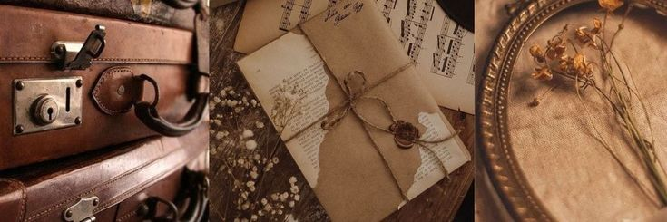

<p align="center">
  
</p>
Header credit: Pinterest

# ✨ Nostalgia Threads 🧵🤎  
*A space to share and connect through cultural memories.*


## About the Project ✍️ 
Nostalgia Threads is a social web platform designed to let users could share short, emotionally resonant stories tied to region, culture, or identity. Think of it as a digital memory lane - filled with stories, snippets, and shared experiences.


## Project Status and Personal Note 📝 😊 
Nostalgia Threads was born out of a shared desire to build a space where people could share short, culture-rooted memories, and emotionally connect across communities. 
I came up with the original idea, mapped out the tech stack, and designed the early system architecture - including building the initial database structure.

The first version of the project was developed in a team setting, but I'm currently working on refining and evolving it into something more aligned with my creative vision. From redesigning the UI to expanding features, this is an ongoing passion project that I'm actively rebuilding and reimagining. <insert thought emoji here>


## Core Features 🛠️ 

- Users can post short text-based memories (max 500 characters)
- Each memory is tagged with a region and optional hashtags
- Reactions feature allows users to respond with emojis
- Memories are stored in a **priority queue** to show the most-reacted ones first
- Tag search and region based filtering powered by a **Trie data structure**.
- Responsive UI with modals for posting and account access.
- **JWT-based authentication** and **session flow**.

## Tech Stack 🧱 


| **Layer**     | **Tools & Frameworks**                                   |
|---------------|----------------------------------------------------------|
| **Frontend**  | React 19, React Router 7, Vite, Tailwind CSS             |
| **Backend**   | Django 5, Django Rest Framework, Python 3.9              |
| **Database**  | SQLite - schema planned and implemented by me            |
| **Auth**      | Simple JWT (access and refresh token handling            |
| **Dev Tools** | Python venv, npm/yarn, Docker (optional frontend build   |

## Getting Started 🧵😮 

To run the project locally, clone the repository and follow the setup instructions for both frontend and backend.


### Backend Setup (Django) 🌲 

1. **Navigate to backend directory:**
   ```bash
   cd backend
   ```

2. **Create a virtual environment and activate it:**
   ```bash
   python -m venv venv
   source venv/bin/activate        # Mac/Linux
   venv\Scripts\activate         # Windows
   ```

3. **Install dependencies:**
   ```bash
   pip install -r requirements.txt
   ```

4. **Apply migrations:**
   ```bash
   python manage.py migrate
   ```

5. **Start the server:**
   ```bash
   python manage.py runserver
   ```


### Frontend Setup (React) 🖥️ 

1. **Navigate to frontend directory:**
   ```bash
   cd frontend
   ```

2. **Install dependencies:**
   ```bash
   npm install
   ```

3. **Run the dev server:**
   ```bash
   npm run dev
   ```

> 💡 *Optional:* You can also build and run the frontend with Docker (see `frontend/Dockerfile`).


## Planned Improvements ✍️ 

- Redesign the UI with a warmer, more immersive memory-sharing experience  
- Rebuild core components using a mobile-first design approach  
- Refactor authentication for better user session handling
-  Add smoother emoji reaction animations  
- Expand tag-based memory discovery  
- Consider implementing audio/voice notes to enhance the intimacy of memories  


## Folder Structure 📁

```
nostalgia-threads/
├── backend/                  # Django REST API
│   ├── api/                  # Models, views, serializers
│   └── manage.py
├── frontend/                 # React app with routing
│   ├── app/                  # Components and routes
│   └── public/
├── home.png                  # Landing page screenshot
├── feed.png                  # Feed screenshot
└── README.md                 # You're here!
```

## 🙏✨ Acknowledgements

I’d like to express my sincere gratitude to **Professor [Shannon Reckinger]** for granting me the opportunity to work on this Final Group Project and for her guidance throughout the semester. Her encouragement created a space for exploration and creativity that made this project possible.

A heartfelt thank you to our **Teaching Assistant [Nandana Sheri]**, whose technical insights—especially around authentication and secure API structure—shaped many of the architectural choices we made. Her advice was both practical and empowering, and I’m incredibly grateful for the time she took to support our progress.

Lastly, I want to acknowledge my **teammates** for laying down the initial foundation of this project. The base setup and core features already in place gave me something to build on and refine, and I appreciate the efforts that went into those contributions.

This project, like all things meaningful, was made possible by collective effort—and I'm thankful for every part of it.

## 👩🏽‍💻✨  About Me

Hi! I’m Srijita, a recent Computer Science graduate from UIC with a passion for storytelling and art through tech. I love working on projects that bring together thoughtful design, meaningful interaction, and clean architecture — especially when they’re inspired by real-life emotions and cultural connection.

Nostalgia Threads is one of those deeply personal ideas I’ve wanted to explore for a while — and I’m proud to keep refining it as I grow.

Feel free to connect or reach out 🫶  
📧 Email: [banerjeesrj@gmail.com]  
🔗 LinkedIn: [https://www.linkedin.com/in/srijitabanerjee/]

