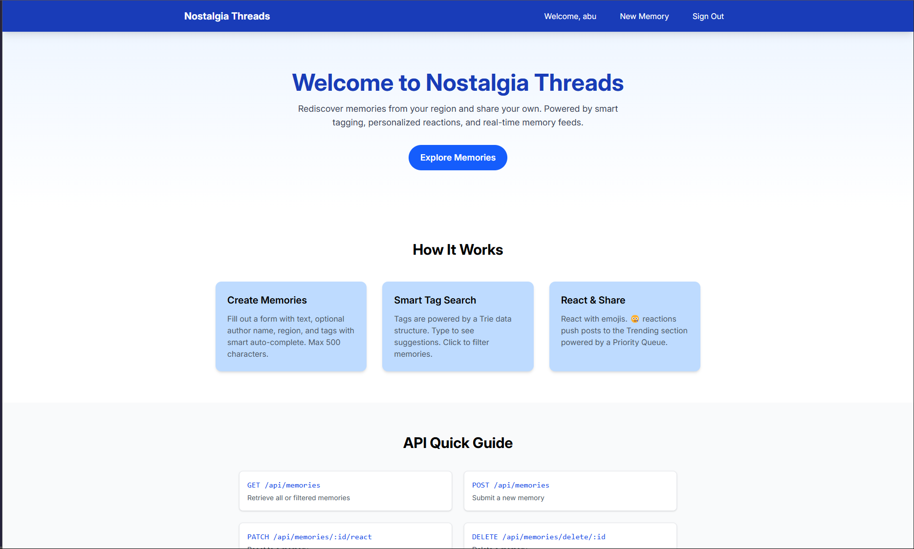
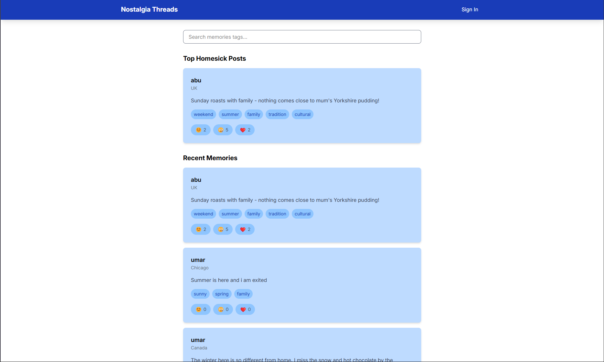

# Nostalgia Threads 🌟

A social platform for sharing and connecting through cultural memories.

## Landing Page

## Home Page

## About

Memory Lane is a community-driven platform where users can share their cultural memories through short "memory cards". Connect with others through shared experiences, discover new cultural perspectives, and find comfort in shared nostalgia.

## Features 🎯

- 📝 Share short memory stories (up to 500 characters)
- 🏷️ Tag-based organization with smart auto-complete
- 🌍 Region-based filtering
- 💝 Interactive reactions:
  - 🥲 Homesick
  - 💖 Relate
  - 👀 Curious
- 🔥 Trending section showing most relatable memories
- 🔍 Smart tag search with auto-suggestions

## How to use this project

1. Browse the memory feed to discover stories
2. Click on tags to find related memories
3. Share your own memory:
   - Write your story (anonymous option available)
   - Add your region
   - Include relevant tags
   - Submit and connect!

## Technical Overview 🛠️

### Frontend

- Memory card feed interface
- Interactive reaction system
- Tag-based search with auto-complete
- Post creation form

### Backend

- RESTful API endpoints:
  - GET /api/memories
  - POST /api/memories
  - PATCH /api/memories/:id/react
  - GET /api/memories?tag=:tag
- Data Structures:
  - Trie for tag auto-completion
  - Priority Queue for trending posts
  - Memory storage system

## Table of Contents

- [About](#about)
- [Features](#features-)
- [How to use this project](#how-to-use-this-project)
- [Technical Overview](#technical-overview-%EF%B8%8F)
- [Project Roadmap](#project-roadmap)
- [Contributors](#contributors)
- [Acknowledgments](#acknowledgments)

<!-- - Use this html element to create a back to top button. -->

<a href="#how-to-use-this-project">back to top ⬆️</a>

## Project Roadmap

### Phase 1: Core Features

- [x] Basic memory feed
- [x] Memory posting system
- [x] Reaction system
- [x] Tag implementation

### Phase 2: Advanced Features

- [ ] Trending section
- [ ] Advanced tag search
- [x] User profiles
- [x] Mobile optimization

<!-- - Use this html element to create a back to top button. -->

<a href="#how-to-use-this-project">back to top ⬆️</a>

## Contributors<!-- Required -->

### Team Members 👥

- Umar Khan
- Srijita Banerjee
- Awaish

<!--  -->

## Acknowledgments<!-- Optional -->

Special thanks to:

- Professor Reckinger for guidance and support
- Nandana for valuable assistance
- All beta testers and early users of Nostalgia Threads

<!-- - Use this html element to create a back to top button. -->

<a href="#how-to-use-this-project">back to top ⬆️</a>

